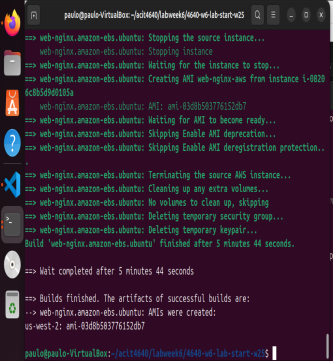
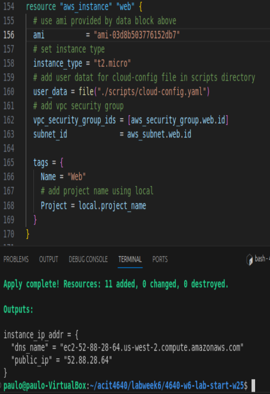
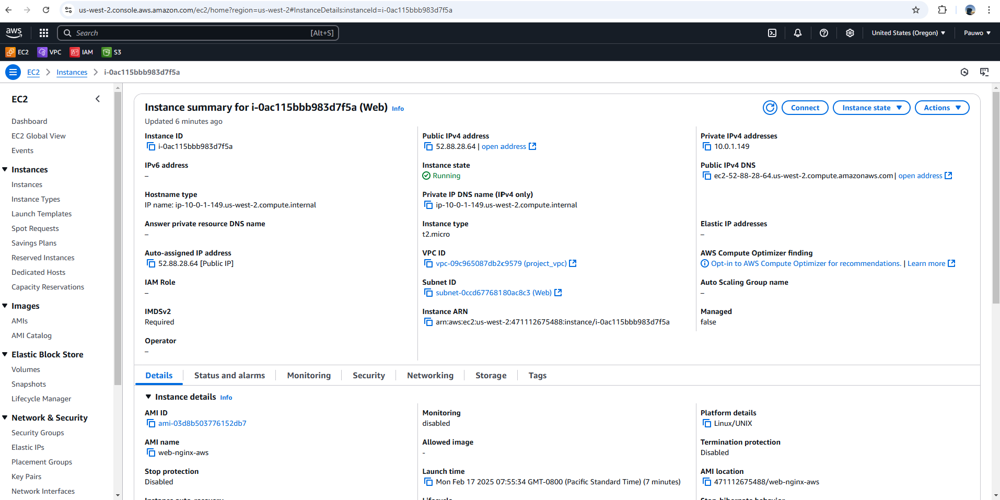

# Lab 6 Images

## This image shows the HTML document served by a running instance of my AMI

## This image shows the creation of the AMI

## This image shows the code that I'm using the AMI that I just created

## This image displays the AWS settings of my instance, including the IP address I used and the AMI

